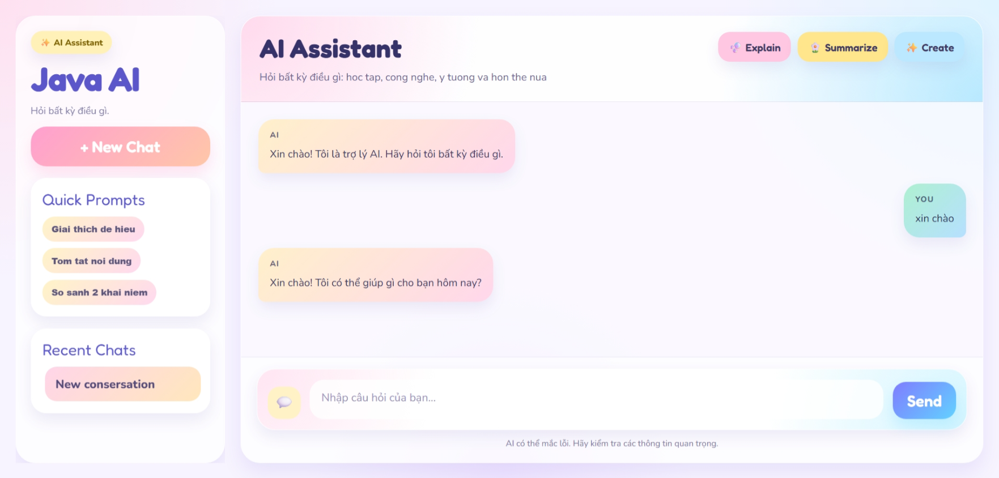

# Mini Java AI Chatbot

[](https://www.oracle.com/java/)
[](https://spring.io/projects/spring-boot)

This project is a lightweight AI chatbot built with Spring Boot, designed as part of my **Java Programming** coursework. It demonstrates how to integrate modern AI services (Google Gemini API) into a full-stack web application.

This project serves as a foundational learning tool, and I plan to implement new features and improvements in the future! 🚀

## ✨ Features

* **AI Integration:** Connects to the Google Gemini API to generate intelligent, real-time responses.
* **Rich Text Rendering:** Supports Markdown (via `marked.js`) and LaTeX math equations (via `MathJax`) for formatted and readable AI outputs.
* **Modern UI:** Features a "Soft Playful" design with a responsive and user-friendly chat interface.
* **Extensible Architecture:** Built with Spring Boot, making it easy to add new endpoints and services later.

## 🛠️ Tech Stack

* **Backend:** Java, Spring Boot, Maven
* **Frontend:** HTML, CSS, Vanilla JavaScript
* **External Libraries:** Marked.js (Markdown parsing), MathJax (Mathematical notation)
* **API:** Google Generative AI (Gemini)

## 🏗️ Architecture

The application follows a simple client-server architecture:

* **Frontend (HTML/CSS/JS):** Handles UI and user interaction
* **Backend (Spring Boot):** Processes requests and communicates with Gemini API
* **External API (Google Gemini):** Generates AI responses

## 📁 Project Structure

```bash
src/main/java/com/example/chatbot/
├── config/        # Configuration classes  
├── controller/    # REST controllers  
├── dto/           # Request/Response objects  
├── service/       # Business logic  

src/main/resources/
├── static/        # Frontend (HTML, CSS, JS)  
├── application.properties  
```

## 📸 Demo



## 📄 License

This project is licensed under the MIT License.
